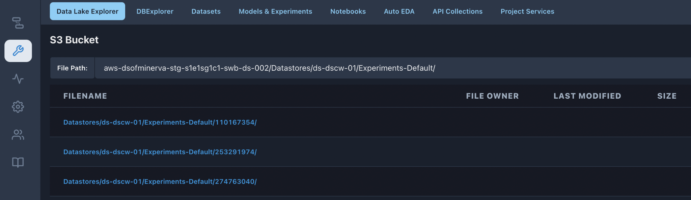

**Data Lake Explorer** 
^^^^^^^^^^^^^^^^^^^^^^

This feature in the platform enables the user to browse through the
contents of a s3 bucket.

Users can also run auto-eda on selected files from this page. By
clicking on “Run Auto EDA” for a particular file, the user is redirected
to the Auto EDA page and that dataset gets added to the EDA table.

Users who have permission to access Cluster Configurations need to set
valid s3 credentials in the s3.xml in the configurations tab.
s3_base_bucket should be the bucket name whose contents needs to be
displayed and s3_path contains the path inside the bucket.

