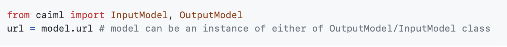

**Models and Experiments** 
^^^^^^^^^^^^^^^^^^^^^^^^^^

The platform supports tracking, updating, and visualizing models. Models
are stored as experiment artifacts, but unlike other artifacts that are
dependent, models are independent entities with their own unique ID.
Models can be accessed directly with a model object or indirectly via
their creating experiment. This property makes models a standalone entry
that can be used as an artifactory interface. These can be found under
“Models and Experiments” tab in the Developer tab.

**Experiments :**

An experiment refers to a code execution session. An experiment captures
the python environment, run information, console output,
hyperparameters, artifacts and plots (recorded automatically).

**How to use?**

There are multiple functionalities that can be performed for an
experiment like creating, getting an existing experiment, monitoring the
progress etc. Users have to write code in Notebooks for each of the
functionalities listed above. To make it easier for the users, we have
provided code snippets in Notebooks under Code Snippet Explorer ->
Experiments. Snippets can be easily dragged-and-dropped for usage. Let
us see examples of how few functionalities can be implemented :

1) Create an Experiment :

..

   .. image:: vertopal_09389ccfa10c4c9d9f37eba7fe242877/media/image75.png
      :width: 6.74479in
      :height: 2.13585in

2) Get an existing experiment : |image4|

3) Monitor an experiment’s progress :

..

   .. image:: vertopal_09389ccfa10c4c9d9f37eba7fe242877/media/image5.png
      :width: 6.73087in
      :height: 0.99826in

   An experiment's progress can be seen in the experiments list panel as
   a loader and in the INFO tab. In the image below, the progress is
   50%.

   .. image:: vertopal_09389ccfa10c4c9d9f37eba7fe242877/media/image29.png
      :width: 6.64063in
      :height: 2.20432in

Similarly, other functionalities related to hyperparameters, artifacts,
finalizing an experiment etc. can be implemented and for each of them
code snippets can be found in the notebooks under code snippet explorer.

**Models :**

CaiML provides automatic recording of standard python models such as
Tensorflow, Keras, Pytorch, scikit-learn (only using joblib), XGBoost
(only using joblib), FastAI, MegEngine and CatBoost.

**How to use?**

There are multiple functionalities that can be performed for a model
like record a model, manually log a model, use a registered model,
update a model etc. Users have to write code in Notebooks for each of
the functionalities listed above. To make it easier for the users, we
have provided code snippets in Notebooks under Code Snippet Explorer ->
Models. Let us see examples of how few functionalities can be
implemented :

1) Record a Model : (Manually log a Model)

..

   .. image:: vertopal_09389ccfa10c4c9d9f37eba7fe242877/media/image2.png
      :width: 5.07022in
      :height: 0.62674in

   .. image:: vertopal_09389ccfa10c4c9d9f37eba7fe242877/media/image50.png
      :width: 6.36404in
      :height: 2.5191in

   .. image:: vertopal_09389ccfa10c4c9d9f37eba7fe242877/media/image41.png
      :width: 6.44271in
      :height: 1.54804in

2) Get instance of a Registered Model :

..

   .. image:: vertopal_09389ccfa10c4c9d9f37eba7fe242877/media/image78.png
      :width: 6.43229in
      :height: 0.49626in

3) Get Model URL :

Similarly, other functionalities like getting instance of an external
model, adding metadata to a model, finalizing a model etc. can be
implemented and for each of them code snippets can be found in the
notebooks under code snippet explorer.

.. |image4| image:: vertopal_09389ccfa10c4c9d9f37eba7fe242877/media/image33.png
   :width: 6.45313in
   :height: 0.31369in