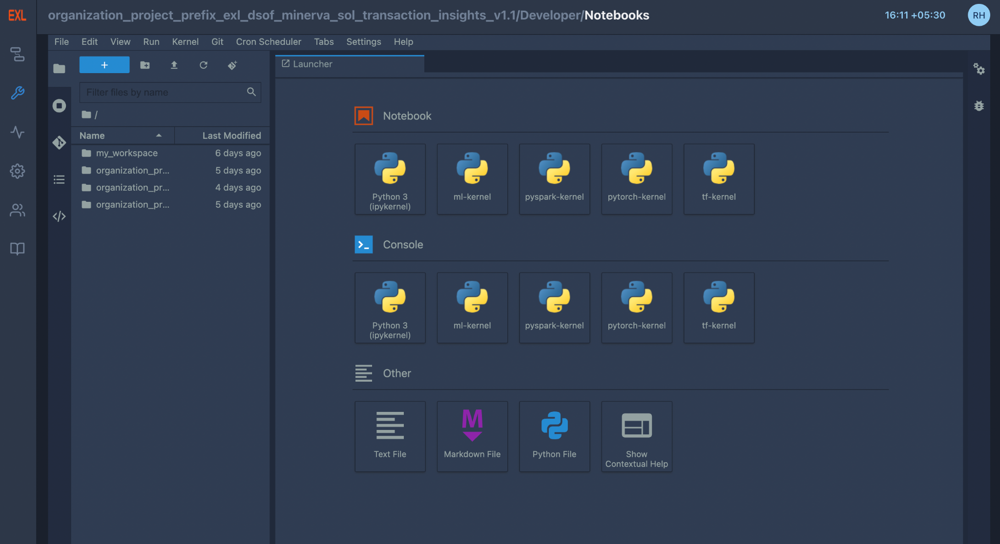
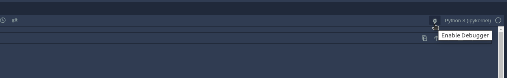
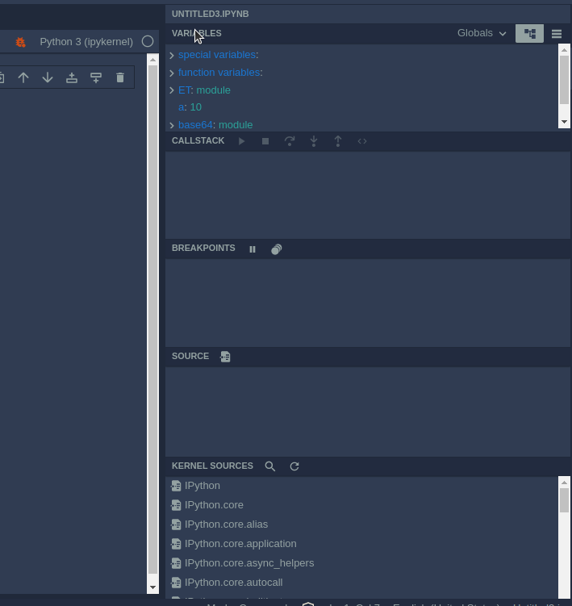
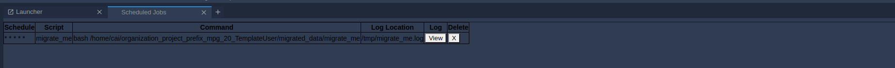

**Notebooks**
^^^^^^^^^^^^^

It provides the best way to serve AI Notebooks to multiple users. It is
a multi-user Hub that spawns, manages, and proxies multiple instances of
the single-user notebook servers. Any user can drag and drop basic code
snippets in Notebooks and edit them based on the requirement of the
project. Additionally, models written in Notebooks can be scheduled
based on the user's requirements.

DSCW Notebooks provides the best way to serve Notebooks to multiple
users. It is a multi-user Hub that spawns, manages, and proxies multiple
instances of the single-user notebook servers.

.. _overview-1:

**Overview**
''''''''''''

-  Launcher

   -  Notebook

   -  Console

   -  Others

-  FAAS Snippets

-  Git Integration

-  Logging and Debugger

-  Scheduling

**Launcher**
''''''''''''

The launcher contains three parts :

1) **Notebook** - DSCW offers Notebooks with multiple kernels including
      :

-  Ipy-kernel - Basic functionality of python notebooks can be found in
      this kernel

-  ML-kernel - It pre-installed common ML libraries like sci-kit learn,
      NumPy, pandas, etc.

-  TF-kernel - Tensorflow kernel contains pre-installed
      tensorflow-related libraries along

-  PyTorch-kernel - PyTorch kernel contains pre-installed
      PyTorch-related libraries

-  Spark - Scala Spark kernel contains pre-installed related libraries

-  PySpark - PySpark kernel contains pre-installed related libraries

-  SparkR - R kernel contains pre-installed related libraries

..

   .. image:: vertopal_09389ccfa10c4c9d9f37eba7fe242877/media/image48.png
      :width: 4.42188in
      :height: 1.306in

2) **Console**: DSCW provides consoles of kernels which help users
      execute their commands and scripts line by line.

..

   .. image:: vertopal_09389ccfa10c4c9d9f37eba7fe242877/media/image15.png
      :width: 4.41667in
      :height: 1.30606in

3) **Others**: Text file, Markdown file, Python file, and Contextual
      help (documentation of a given function on-click) are other
      functionalities that DSCW provides.

..

   .. image:: vertopal_09389ccfa10c4c9d9f37eba7fe242877/media/image49.png
      :width: 3.63542in
      :height: 1.3503in

**Reusable Snippets**
'''''''''''''''''''''

-  DSCW Notebooks brings forth the idea of introducing code snippets
      that can be inserted into a notebook **by drag and drop** or **on
      right click and insert**.

-  The user can introduce their code snippets, *edit* existing snippets,
      *copy*, *download* or *insert* them into their notebook.

-  The user can also Search snippets and Filter snippets by tags.

-  There are already existing multiple code snippets that users can
      browse through in the notebooks, from basic i/o code snippets to
      deep learning code snippets.

..

   .. image:: vertopal_09389ccfa10c4c9d9f37eba7fe242877/media/image86.png
      :width: 3.5in
      :height: 2.19708in

**Git Integration**
'''''''''''''''''''

A basic version control system with git integration is provided allowing
users to keep their projects updated with the team.

-  Interactive UI provided for git repository management instead of
      users updating their codes via command line.

..

   .. image:: vertopal_09389ccfa10c4c9d9f37eba7fe242877/media/image17.png
      :width: 2.54688in
      :height: 2.85587in

-  Easier and Faster project management allowing users to compare their
      code versions in the Notebook itself.

..

   .. image:: vertopal_09389ccfa10c4c9d9f37eba7fe242877/media/image70.png
      :width: 5.64914in
      :height: 1.82813in

-  Basic functionalities like push, pull, commit, making new branches,
      etc. have been provided in the Notebook UI.

..

   .. image:: vertopal_09389ccfa10c4c9d9f37eba7fe242877/media/image83.png
      :width: 2.28125in
      :height: 2.51042in

**Logging and Debugger**
''''''''''''''''''''''''

Users can see the logs by browsing in the Notebooks menu bar (Views ->
Show Log Console) which will open the log console where users will be
able to view the logs.

|image5|\ |image6|

The debugger can be used by clicking the “Enable Debugger” icon present
on the top right corner of the Notebooks besides the kernel name.

Debugger has multiple options as can be seen in the figure above. The
current set of all the variables defined in that notebook can be seen in
the “Variables” section. “Breakpoints” can be used to help the user
control the flow of the program. In “Callstack”, any user can see the
current execution flow of the application at any particular breakpoint.
In “Kernel Sources”, users can browse all the installed libraries for
the notebook.

**Scheduling**
''''''''''''''

Users can schedule when they want to run the model based on their
requirements by right-clicking on the notebook in the file explorer.
Notebook uses a cron scheduler to schedule the tasks and all the tasks
can be viewed in ‘Show cronjobs’. In case the pod is not running at the
scheduled time of the task, the pod is automatically started to run the
task.

.. |image5| image:: vertopal_09389ccfa10c4c9d9f37eba7fe242877/media/image1.png
   :width: 1.58996in
   :height: 2.91493in
.. |image6| image:: vertopal_09389ccfa10c4c9d9f37eba7fe242877/media/image20.png
   :width: 3.4375in
   :height: 2.27257in