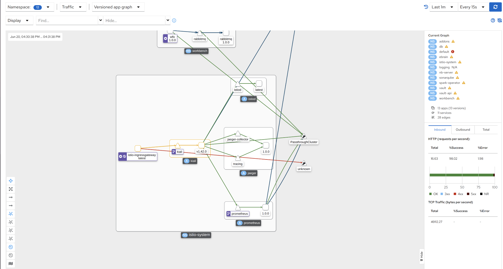
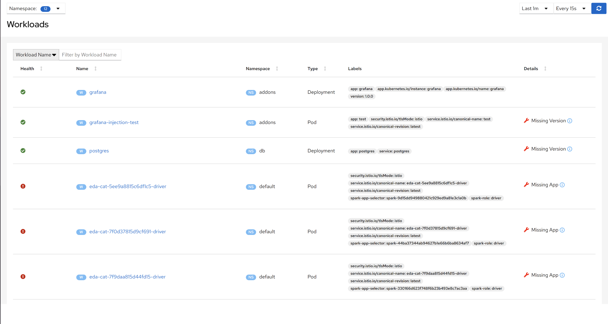
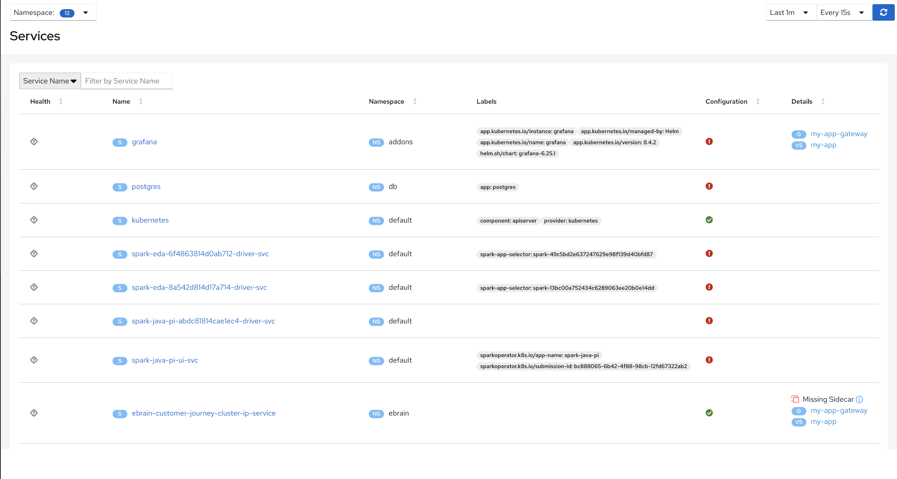
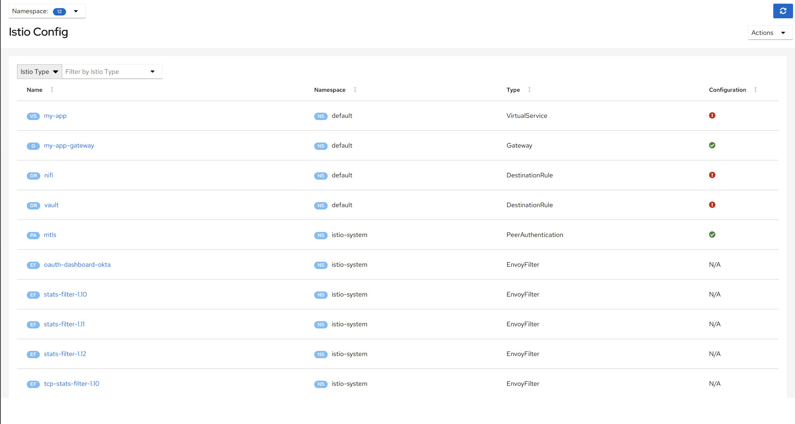

.. _section-7:

**Observability**
^^^^^^^^^^^^^^^^^

Observability is an observation tool for Istio with service mesh
configuration and validation capabilities. It provides insight into the
structure and health of your service mesh.

**Overview**
''''''''''''

In the first screen user encounters when opening DSCW-Observability,
he/she can monitor all the namespaces in your deployment at a glance.
You can choose to monitor the health of Apps, Workloads, or Services
from the dropdown menu in the upper right corner of your screen. You can
navigate to different screens using the side panel located on the left
side of your screen.

**Graph**
'''''''''

The Graph screen lets you monitor all the connections in your
deployment. The bigger boxes represent namespaces while the smaller
boxes represent applications, the circles represent workloads, the
triangles represent the services, and lastly, the lines represent
network connections.

Clicking on the applications, namespaces, or services focuses on its
immediate connections and gives a detailed view of its network traffic.
Clicking on a connection focuses on the components it connects.

**Applications**
''''''''''''''''

The applications screen allows you to browse through a list of all
applications used in your deployment. You can also filter the
applications by their namespace using the namespace filter in the upper
left corner of the screen.

Clicking on an application leads to a more detailed view containing
various metrics for that application.

.. _section-8:

|image7|
========

**Workloads**
'''''''''''''

The workloads screen allows you to browse through a list of all
workloads used in your deployment. You can also filter the workloads by
their namespace using the namespace filter at the upper left corner of
the screen.

Clicking on a workload leads to a more detailed view containing various
metrics for that workload.

**Services**
''''''''''''

The services screen allows you to browse through a list of all services
used in your deployment. You can also filter the services by their
namespace using the namespace filter at the upper left corner of the
screen.

Clicking on a service leads to a more detailed view containing various
metrics for that workload.

**Istio Config**
''''''''''''''''

The Istio Config screen allows you to browse through a list of all istio
configs used in your deployment. You can also filter the configs by
their namespace using the namespace filter at the upper left corner of
the screen.

[Only for admins] Clicking on a config leads to an editor that allows
you to edit it.

.. |image7| image:: vertopal_09389ccfa10c4c9d9f37eba7fe242877/media/image7.png
   :width: 4.86979in
   :height: 2.55393in