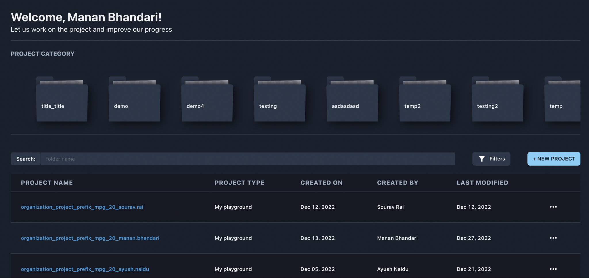

AI PLATFORM USER GUIDE
======================

DSCW WORKBENCH
--------------

The platform is a one stop platform for various functionalities and
steps involved in any machine learning process from storing data,
training and testing models to storing models. Due to multiple
functionalities being provided by the platform, we have divided each
functionality broadly into tabs that can be seen in the left side panel
in the platform UI. Let us discuss each tab and multiple features
provided in each of them.

**Project Specific Segregation**
~~~~~~~~~~~~~~~~~~~~~~~~~~~~~~~~

Projects provide a logical structure similar to file system folders. A
crucial part of the platform to segregate and organize user’s content is
to divide the work into projects. Only users who are part of a
particular project can access the contents of that project. Project
Segregation helps any user to be part of multiple projects, divide the
tasks systematically and work in an organized manner. Indirectly, having
this feature also helps in better efficiency, collaboration, increase in
productivity etc.

All the projects can be further categorized by assigning a project category 
to each project once created. This helps the users to filter all the projects
that are a part of a particular project category.

- Only some roles (admin and workspace custodian, as of now) have the permission to create, delete and pin the project, add users in the project and assign project category to that particular project.
- The home screen (after login) shows  existing project categories and project table where the user gets to view the projects he/she is a part of.
- Project category can only be assigned once the project is created. This can be done from the action button (ellipses icon) seen in each row of the project table.
- Once clicked on any project category, the project table shows all the projects that belong to that particular project category only. 

Once the user clicks on any project listed in the table, he/she can
access all the development related files and folders based on the role
they are assigned in the platform. Each project has unique pipelines,
datasets, models, experiments, code artifacts, notebooks. With that,
users get to perform auto EDA and auto API building and get the
processed outputs specific to that project. The logs generated through
all the features listed above are also project specific and can be
understood through the tools developed within the platform.

Some specific roles (admin, as of now) can set the cluster
configurations and connections based on the requirements. For example,
spark configuration is used to configure the spark tasks and is
responsible for managing that particular service. In the pipeline code
specify what config group to use and the pipeline runs using those
particular configurations saved in the configuration group. If there are
multiple sets of config groups, specify in the pipeline which particular
config-set be used.

.. toctree::
      :maxdepth: 2
      :hidden:

      pipelines

.. toctree::
      :maxdepth: 2
      :hidden:

      developer

.. toctree::
      :maxdepth: 2
      :hidden:
      
      monitor

.. toctree::
      :maxdepth: 2
      :hidden:

      configuration

.. |image1| image:: vertopal_09389ccfa10c4c9d9f37eba7fe242877/media/image22.png
   :width: 8.10938in
   :height: 6.49803in
.. |image2| image:: vertopal_09389ccfa10c4c9d9f37eba7fe242877/media/image64.png
   :width: 7.74479in
   :height: 7.79941in
.. |image3| image:: vertopal_09389ccfa10c4c9d9f37eba7fe242877/media/image37.png
   :width: 5.94792in
   :height: 0.97917in
.. |image4| image:: vertopal_09389ccfa10c4c9d9f37eba7fe242877/media/image33.png
   :width: 6.45313in
   :height: 0.31369in
.. |image5| image:: vertopal_09389ccfa10c4c9d9f37eba7fe242877/media/image1.png
   :width: 1.58996in
   :height: 2.91493in
.. |image6| image:: vertopal_09389ccfa10c4c9d9f37eba7fe242877/media/image20.png
   :width: 3.4375in
   :height: 2.27257in
.. |image7| image:: vertopal_09389ccfa10c4c9d9f37eba7fe242877/media/image7.png
   :width: 4.86979in
   :height: 2.55393in
.. |image8| image:: vertopal_09389ccfa10c4c9d9f37eba7fe242877/media/image65.png
   :width: 6.27083in
   :height: 2.0182in